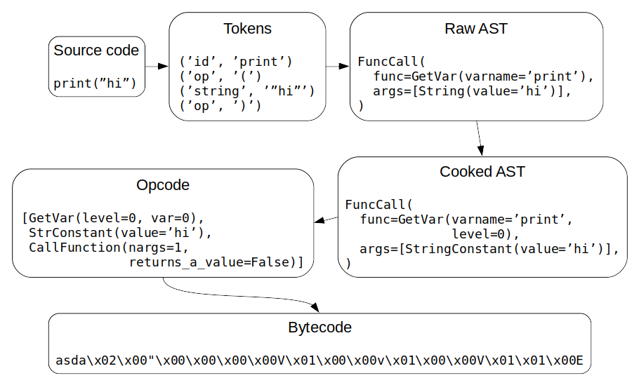

# The Asda Compiler

This page documents the internals of `asdac`, including lots of details. It's
mostly useful for people who want to develop the compiler in some way, or who
just want to know how it works. Right now this page also contains lots of
details about asda's syntax, although I'm planning on moving those things to a
separate page later.

`asdac`, short for "asda compiler", reads source code from a `.asda` file and
then outputs non-human-readable bytecode to a `.asdac` file. Here's a
high-level overview of how it does that:



Each step is explained in more detail below.


## Tokens

Tokenizing is the first step after reading the source code. Asda has tokens of
a few different types:

- **Integer tokens** consists of a 1-9 digit followed by zero or more 0-9
  digits, or the digit 0. For example, `0` and `123` are valid integer tokens,
  but `-123` is not. Only non-negative integers are currently supported in
  asda.
- **Identifier tokens** or **ID tokens** are for things like variable names and
  type names. They consist of a wordy character that is not a digit followed by
  zero or more wordy characters. Here "wordy character" means a character that
  matches `\w` in Python's regex.
- **Operator tokens** are one of `(`, `)`, `[`, `]`, `.`, `,`, `:`, `;` and `=`.
- **Keyword tokens** are like identifier tokens, but one of `let`, `if`,
  `else`, `while`, `for`, `void`, `return`, `generator` and `yield`.
- **Strings** are `"` followed by zero or more non-`"` and non-newline
  characters, and then another `"`. There are no escape sequences yet, so it's
  impossible to create a string that contains e.g. `"` or a newline character.
- **Newline tokens** match CRLF or LF in the source code, and they represent
  line breaks. Note that for an empty line (or a line that contains nothing but
  whitespace and/or a comment), only one newline token is created, even though
  there are multiple newline characters in the source code.
- If there are spaces at the beginning of a line, that is considered as
  indentation, but otherwise spaces and tabs are ignored.
- Anything not mentioned above is an error.

The tokenizer is also responsible for keeping track of indentation and creating
indent and dedent tokens appropriately. The indentation characters must be
spaces, but asdac accepts any number of spaces per indentation level; that is,
this code...

```js
if a:
 if b:
                c()
```

...does the same thing as this code:

```js
if a:
    if b:
        c()
```

In these examples, there are indent tokens after `if a:` and `if b:`, and two
dedent tokens at the end of the example code (unless more indented code
follows). However, this...

```js
if a:
    if b:
        c()
      d()
```

...is an error because `d()` doesn't match any of the indentations before it.

The tokenizer also checks for indenting related errors using the fact that the
only valid token sequence containing indents or colons is "colon newline
indent". In other words, every `:` must be followed by a newline and an indent,
and every indent must be preceded by `:` and a newline.


## Raw AST

Unlike e.g. CPython, asdac has two kinds of [AST], and this is the first kind.
At this stage, asdac doesn't know yet anything about the types of variables or
where each variable is defined; raw AST just represents what is done. For
example, the raw AST of `let x = y` tells that a new local variable called `x`
is being created, and its initial value will be the value of a variable called
`y`. It does **not** tell what type the `x` variable will be or which scope the
`y` variable comes from.

The raw AST consists of a few different kinds of objects that represent code,
also known as AST nodes:

- **Expressions** are pieces of code that create a resulting value, like
  `some_variable`, `print` or `some_function_that_returns_something()`. Note
  that type names like `Str` are not expressions.
- **Statements** are what most people like to think of as lines of code, such
  as `let x = y` or `print(some_variable)`. 

Expressions:

- **Integer literals** and **string literals** correspond to integer
  [tokens](#tokens) and string tokens.
- **Variable lookups** correspond to identifier tokens, but identifier tokens
  can represent other things too, depending on the context. For example, the
  identifier token `Str` is a type name, not a variable lookup expression.
- **Function calls** consist of a function, `(`, a `,`-separated list of
  arguments, and `)`. The function and the arguments are expressions.

Statements:

- **Let statements** consist of `let`, an identifier, `=` and an expression.
- **Variable assignments** consist of an identifier, `=` and an expression.
- **Return statements** and **yield statements** consist of `return` or `yield`
  followed by an expression.
- **Function calls** are valid expressions **and** valid statements.
- **If statements** consist of `if`, an expression, `:` and a body, optionally
  followed by `else`, `:` and another body.
- **For statements** look like `for init; cond; incr:` followed by a body.
  `init` and `incr` are statements that don't contain a body, and `cond` is an
  expression.
- **While statements** consist of `while`, an expression, `:` and a body.
- **Function definitions** consist of a few different parts. The first part can
  be a type, `void` or `generator[ ]` with a type between `[` and `]`. That is
  followed by an identifier and `(`. Then a comma-separated list of zero or
  more `type identifier` pairs follows, and finally `)`, `:` and a body.

Here "body" means a newline, an indent, one or more statements and a dedent.

Types are not expressions in asda. Currently the only valid types are the
identifiers `Str`, `Int` and `Bool`.

[AST]: https://en.wikipedia.org/wiki/Abstract_syntax_tree


## Cooked AST

This is called "cooked" because it's more processed than what I ended up
calling "raw AST". Unlike raw AST, cooked AST contains information about types
of expressions and variables, as well as the scopes that variables are looked
up from (this is represented by a "level" so that 0 means the built-in scope, 1
means the asda file's scope, 2 means a function defined at level 1 etc). Most
error messages related to wrong types, variables being already defined and so
on are created when the raw AST is converted to cooked AST.


## Opcode

This is not AST; instead, opcode consists of instructions for the interpreter
that I ended up calling ops. In the interpreter, there's a stack (basically an
array) of things, and these ops tell the interpreter to push and pop things to
and from the stack. Also, instead of ifs and loops, there are ops that tell the
interpreter to move to a different place in the opcode, a lot like goto
statements in some other programming languages. Instead of "goto", it's called
"jump" in this context.

Along with the stack, running asda code also has an array for local variables.
In the opcode, variables are represented by integers that will later become
indexes of this array of local variables.

When a function defined in asda is called, a new stack and a new local variable
array are created, and all the arguments passed to the function call are added
to the beginning of the local variable array.

Most ops push an object to the stack or pop an item off of the stack. For
example, the op for looking up a variable pushes a variable to the stack, and
the op for jumping conditionally pops a variable off of the stack and jumps if
it's `TRUE`.


## Bytecode

This is opcode that will be written to a binary file in a concise but not
human-readable form. The bytecode files always start with the bytes `asda`. You
may find this useful if you want to figure out whether a random file you have
found might be a compiled asda file. The interpreter displays an error if you
tell it to run a file that doesn't start with `asda`.
